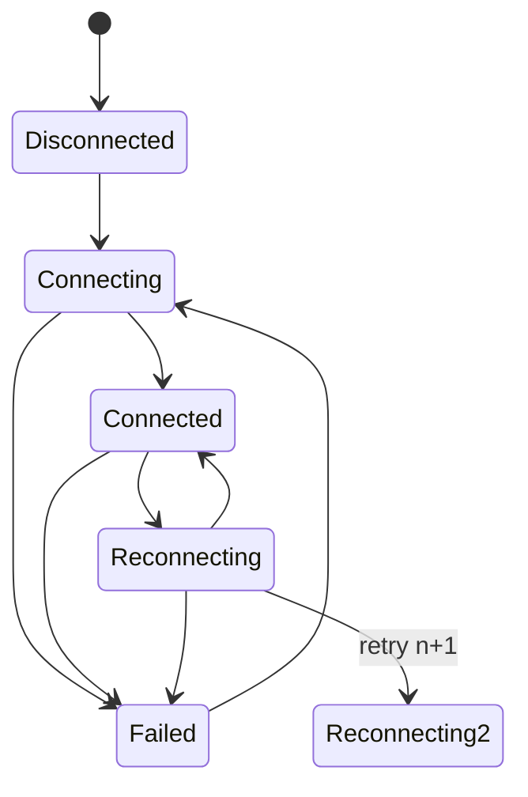

# quicunnel

A **library** crate (no binary) that builds a QUIC client tunnel on top of
[`quinn`](https://github.com/quinn-rs/quinn) and [`rustls`](https://github.com/rustls/rustls),
with mutual-TLS client authentication, a validated connection-state machine,
and a heartbeat sender.

<p align="center">
  
</p>

*One lamp, one beam, one answering light: the tunnel is the beam, not the lamp.*

This is **not** a turnkey tunnel product: it is a client-side library, it does
**not** ship a server, and several "reliability" features exist as tested
components but are not yet wired into the main `Tunnel` lifecycle. The
[Status](#status) and [Known limitations](#known-limitations) sections spell
out exactly what works today and what does not.

> **Not published.** `quicunnel` is **not** on crates.io
> (`GET https://crates.io/api/v1/crates/quicunnel` → `crate 'quicunnel' does not exist`).
> Install is via git only — see [Installation](#installation).

## Status

- ✅ — works today, exercised by the test suite.
- ⚠️ — real code exists, but with an important caveat; read before relying on it.
- 🔮 — planned / stubbed, not implemented.

| Area | Status | Notes |
|------|:------:|-------|
| TLS 1.3 mTLS client config (`create_tls_config`) | ✅ | rustls 0.23, client cert + key, webpki system roots |
| Dev cert generation (`generate_device_certificate`) | ✅ | self-signed ECDSA P-256, 365d, ClientAuth EKU, returns DER bytes |
| QUIC client endpoint + connect (`create_endpoint`, `connect_to_cloud`) | ✅ | random local port, 10s keep-alive, 60s idle timeout, IPv4-preferred DNS |
| Bidirectional request/response (`Tunnel::request`) | ✅ | opens a bi-stream, writes, finishes, reads reply (size-capped) |
| Unidirectional stream (`Tunnel::open_uni`) | ✅ | returns a raw `quinn::SendStream` |
| Validated connection state machine (`ConnectionStateMachine`) | ✅ | illegal transitions are rejected; `watch`-channel subscriptions |
| Heartbeat sender (`HeartbeatService`) | ✅ | fire-and-forget JSON over a uni stream, message-type `0x01` + 4-byte BE length |
| Automatic reconnection in `Tunnel` | 🔮 | `ReconnectManager` exists & is unit-tested, but `Tunnel` never calls it (see [Known limitations](#known-limitations)) |
| Heartbeat ack / timeout | 🔮 | `HeartbeatConfig::timeout` is declared but never enforced |

## Installation

Because the crate is not published, depend on it from git:

```toml
[dependencies]
quicunnel = { git = "https://github.com/SuperInstance/quicunnel.git" }
tokio = { version = "1", features = ["full"] }
```

`quicunnel` is edition-2021. It is developed and tested against recent stable
Rust (CI runs on `stable` across Ubuntu/macOS/Windows). No MSRV is pinned or
verified — if you need one, please open an issue.

## Quick start

### 1. Generate a client certificate (this actually runs end-to-end)

`examples/mtls_setup.rs` is the only example that needs no server. It mints a
self-signed client cert + key as DER files:

```bash
cargo run --example mtls_setup   # writes my-client-123.crt and my-client-123.key
```

The QUIC client wants PEM, so convert with openssl:

```bash
openssl x509 -in my-client-123.crt -inform DER -out client-cert.pem -outform PEM
openssl pkcs8 -topk8 -inform DER -in my-client-123.key -out client-key.pem -outform PEM -nocrypt
```

Or do it in code — `generate_device_certificate` returns DER bytes directly:

```rust,no_run
use quicunnel::tls::generate_device_certificate;

# fn main() -> Result<(), Box<dyn std::error::Error>> {
let (cert, key) = generate_device_certificate("my-client")?;
// cert.as_ref()  -> &[u8] DER certificate
// key.secret_der() -> &[u8] DER private key
std::fs::write("client-cert.der", cert.as_ref())?;
std::fs::write("client-key.der", key.secret_der())?;
# Ok(())
# }
```

### 2. Open a tunnel and send a request

This matches `examples/basic.rs`. **It requires a QUIC server speaking the same
framing at the far end — none is bundled with this crate**, so `cargo run
--example basic` compiles but will fail at `connect()` against the placeholder
`https://quic.example.com:443`.

```rust,no_run
use quicunnel::{Tunnel, TunnelConfig};
use std::path::PathBuf;

#[tokio::main]
async fn main() -> Result<(), Box<dyn std::error::Error>> {
    let config = TunnelConfig {
        server_url: "https://quic.example.com:443".to_string(),
        client_id: "my-client".to_string(),
        cert_path: PathBuf::from("client-cert.pem"),
        key_path: PathBuf::from("client-key.pem"),
        ..Default::default()
    };

    let mut tunnel = Tunnel::new(config)?;
    tunnel.connect().await?;

    let response = tunnel.request(b"Hello, QUIC!").await?;
    println!("Response: {} bytes", response.len());

    tunnel.disconnect().await?;
    Ok(())
}
```

For an unconditional (fire-and-forget) send, use `tunnel.open_uni().await?` to
get a `quinn::SendStream`.

## Architecture

```
Tunnel (src/tunnel.rs)
  ├── create_endpoint / connect_to_cloud   (src/endpoint.rs)  — quinn client
  ├── create_tls_config                     (src/tls.rs)       — rustls mTLS
  ├── ConnectionStateMachine               (src/state.rs)     — validated states
  └── HeartbeatService                     (src/heartbeat.rs) — periodic keep-alive
ReconnectManager / spawn_reconnect_task    (src/reconnect.rs) — standalone, not used by Tunnel yet
types: TunnelConfig / TunnelState / TunnelStats   (src/types.rs)
errors: QuicunnelError                     (src/error.rs)
```

**Connection lifecycle** (state transitions that are actually *allowed* by the
machine; anything else is rejected and logged):



## Configuration

`TunnelConfig` fields and whether they are **actually honored** by the current
code:

| Field | Type | Default | Honored? | Used by |
|-------|------|---------|:--------:|---------|
| `server_url` | `String` | `""` | ✅ | `connect` |
| `client_id` | `String` | `""` | ✅ | heartbeat payload |
| `cert_path` | `PathBuf` | empty | ✅ | TLS config (required, validated non-empty) |
| `key_path` | `PathBuf` | empty | ✅ | TLS config (required, validated non-empty) |
| `heartbeat_interval` | `Duration` | 30s | ✅ | heartbeat loop |
| `max_response_size` | `usize` | 10 MiB | ✅ | `request` read cap |
| `reconnect_delay` | `Duration` | 5s | ⚠️ ignored | nothing reads this |
| `max_reconnect_attempts` | `u32` | 10 | ⚠️ ignored | nothing reads this |
| `connect_timeout` | `Duration` | 30s | ⚠️ ignored | no timeout is applied to `connect` |
| `read_timeout` | `Duration` | 60s | ⚠️ ignored | no timeout is applied to `request` |

The `⚠️ ignored` rows are tracked in [Known limitations](#known-limitations).

`ReconnectConfig` (for the standalone `ReconnectManager`) defaults to: initial
delay 1s, max delay 60s, 10 attempts, 2× backoff.

## Certificates

- **Development:** use `generate_device_certificate` (see Quick start). It
  produces a self-signed ECDSA P-256 cert valid for 365 days with the
  `ClientAuth` extended key usage. The client id is embedded as the CN
  (`client-<id>`) and a SAN DNS name (`<id>.client.quicunnel.local`).
- **Production:** issue client certs from your own CA, then point
  `TunnelConfig.cert_path` / `key_path` at the PEM files. The TLS loader accepts
  RSA (PKCS#1), EC (SEC1), and PKCS#8 PEM private keys. Server certs are
  validated against the bundled Mozilla/webpki root store
  ([`webpki-roots`](https://crates.io/crates/webpki-roots)).

## Build & test

Verified locally (Rust 1.96.1, Linux):

```bash
cargo build --all-targets     # OK, 0 warnings
cargo test  --all             # 28 unit tests + 9 doctests, 0 failed
cargo clippy --all-targets --all-features -- -D warnings   # clean
cargo fmt --all -- --check    # clean
cargo bench --no-run          # benchmarks compile (see below)
```

### Benchmarks

`benches/tunnel.rs` measures **two micro-benchmarks only**: state-machine
transitions and stats-struct accumulation. It does **not** measure real QUIC
throughput (that would require a live server pair). Any end-to-end
performance numbers you may have seen in older docs were not produced by this
crate and should not be relied on.

## CI

`.github/workflows/ci.yml` is a real pipeline (not a placeholder): on push/PR to
`main` it runs `cargo test --all --verbose`, clippy with `-D warnings`,
`cargo fmt --check`, `cargo doc`, `cargo bench --no-run`, a `cargo-audit`
security scan, and `cargo hack` minimal-versions checks, across an
Ubuntu/macOS/Windows matrix on the stable toolchain.

## Known limitations

These are real gaps — please read them before adopting:

- 🔮 **No automatic reconnection in `Tunnel`.** `ReconnectManager` (exponential
  backoff, 1s→60s, 2×, 10 attempts) and `spawn_reconnect_task` are implemented
  and unit-tested in `src/reconnect.rs`, and re-exported from the crate root,
  but `Tunnel` never constructs or drives them. `TunnelProxy::reconnect_internal`
  is a stub that logs and returns `Ok(())`. If the connection drops, you must
  call `connect()` again yourself. Wiring this up is the main outstanding work.
- 🔮 **Heartbeats are one-way with no ack/timeout.** `HeartbeatService` sends a
  JSON heartbeat on a fresh uni stream every `interval`; it never waits for or
  validates an acknowledgment, and `HeartbeatConfig::timeout` is accepted but
  unused. A dropped connection is therefore only detected by quinn's 60s idle
  timeout, not by missed heartbeats.
- ⚠️ **Several `TunnelConfig` fields are ignored:** `reconnect_delay`,
  `max_reconnect_attempts`, `connect_timeout`, and `read_timeout` (see the
  table above). They are kept for API stability but currently have no effect.
- ⚠️ **Most `TunnelStats` counters are never populated.** Only
  `total_bytes_sent`, `total_bytes_received`, `requests_sent`, and
  `requests_succeeded` are updated (in `Tunnel::request`). `heartbeats_sent`,
  `heartbeats_acked`, `requests_failed`, `reconnections`, and
  `avg_latency_ms` are always `0`.
- 🔮 **No bundled server.** The `request`/`connect` examples cannot run
  end-to-end without a QUIC server implementing the same framing.

## License

Dual-licensed under your choice of:

- MIT ([LICENSE-MIT](LICENSE-MIT))
- Apache License, Version 2.0 ([LICENSE-APACHE](LICENSE-APACHE))

## Acknowledgments

Built on [quinn](https://github.com/quinn-rs/quinn),
[rustls](https://github.com/rustls/rustls), and
[tokio](https://tokio.rs/).
